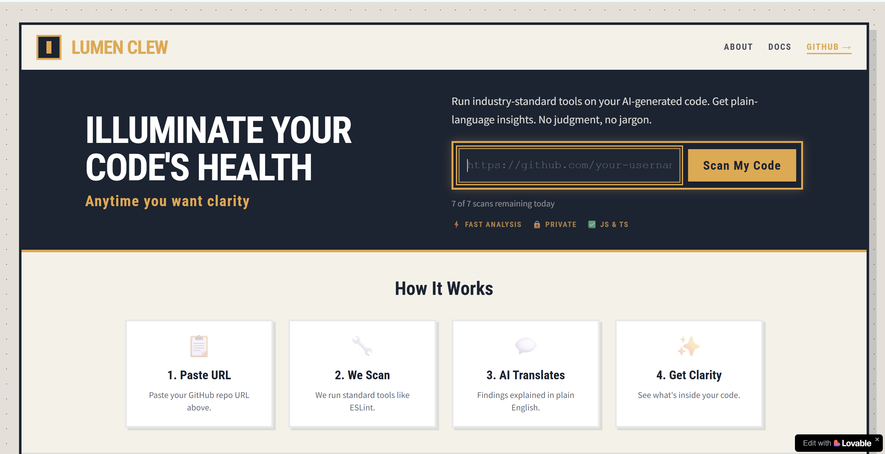

# 🕯️ Lumen Clew

**Friendly code health scanner for JavaScript & TypeScript projects.**



Lumen Clew helps developers understand their codebase through gentle, educational feedback—not judgment. Scan any public GitHub repository and get insights across 4 areas.

🔗 **Try it now:** [lumenclew.lovable.app](https://lumenclew.lovable.app/)

## ✨ Features

- **🔍 Code Quality** - ESLint-powered pattern and consistency checks
- **📦 Dependency Health** - npm audit for known vulnerabilities  
- **🔑 Secrets Detection** - Scans for accidentally committed keys & tokens
- **♿ Accessibility** - JSX/HTML a11y best practice review
- **🤖 AI Explanations** - Claude translates findings into plain English

## 🎯 Philosophy

- **Awareness, not judgment** - Learn without shame
- **Reflection, not direction** - Suggestions, not prescriptions
- **Clean and calm** - No fear-based messaging

## 🛠️ Tech Stack

| Layer | Technologies |
|-------|-------------|
| Frontend | React 18, TypeScript, Vite, Tailwind CSS, shadcn/ui |
| Backend | Node.js, Express (hosted on Render) |
| Analysis | ESLint, npm audit, custom scanners |
| AI | Claude (Anthropic) |

## 🚀 Quick Start

### Use the App
1. Visit [lumenclew.lovable.app](https://lumenclew.lovable.app/)
2. Paste any public GitHub repository URL
3. Click **"Scan My Code"** and review your results

### Run Locally
```sh
git clone https://github.com/YOUR_USERNAME/lumen-clew.git
cd lumen-clew
npm install
npm run dev
```

## 📁 Project Structure

```
├── src/
│   ├── components/     # React UI components
│   ├── pages/          # Route pages (Index, NotFound)
│   ├── hooks/          # Custom React hooks
│   ├── lib/            # Shared utilities & types
│   └── utils/          # Scan utilities (frontend copies)
├── render-backend/     # Node.js backend for Render.com
│   ├── api/            # API endpoint handlers
│   ├── lib/            # Backend config & types
│   └── utils/          # Scan runners & orchestration
└── public/             # Static assets
```

## 📋 Supported Languages

| Status | Language |
|--------|----------|
| ✅ Now | JavaScript (.js, .jsx) |
| ✅ Now | TypeScript (.ts, .tsx) |
| 🚀 Soon | Python, Go, Ruby |

## 🔒 Privacy & Limits

- ✅ Only scans **public** GitHub repositories
- ✅ No code is stored after scan completes
- ⏱️ Rate limited to **10 scans per day** per IP
- 🔄 Resets at midnight UTC

## 📄 License

MIT License - see [LICENSE](LICENSE) for details.

---

Built with 🕯️ using [Lovable](https://lovable.dev)
